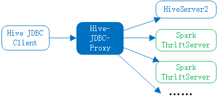

## 引言

Hive-JDBC-Proxy是一个高性能的HiveServer2和Spark ThriftServer的代理服务，具备负载均衡、基于规则转发Hive JDBC的请求给到HiveServer2和Spark ThriftServer的能力。

Hive-JDBC-Proxy甚至可以根据SQL的复杂度和执行性能，实现为用户智能选择是提交给Spark ThriftServer还是HiveServer2。

如下图：

----

## 核心特点

- 支持分组，组内可以配置多个目标HiveServer2或Spark ThriftServer，支持基于规则和负载均衡的方式代理到其中的任意目标服务。

- 支持复杂的规则限制（**以下规则都支持用户自定义处理规则**），如：

  1. 同一个IP下，只允许一个Session。
  
  2. 同一个用户，只允许一个Session。
  
  3. 复杂的登录校验。
  
  4. 支持复杂的处理规则，如检查用户SQL是否合法、修改用户提交的SQL等。
  
  5. 支持statistics统计，统计用户的SQL执行时长和执行频率。
  
  6. 支持自定义负载均衡的规则。
  
- 高并发的处理能力。

- 支持动态加载分组。

----

## RoadMap

1. 支持基于规则，智能选择提交给Spark ThriftServer还是HiveServer2。

2. 对接Apache Calcite，能自动识别Bad SQL，实现基于行和列的权限控制

----

## Contributing

欢迎参与贡献。

----

## Communication

欢迎给Hive-JDBC-Proxy提issue，我将尽快响应。

如您有任何建议，也欢迎给Hive-JDBC-Proxy提issue。